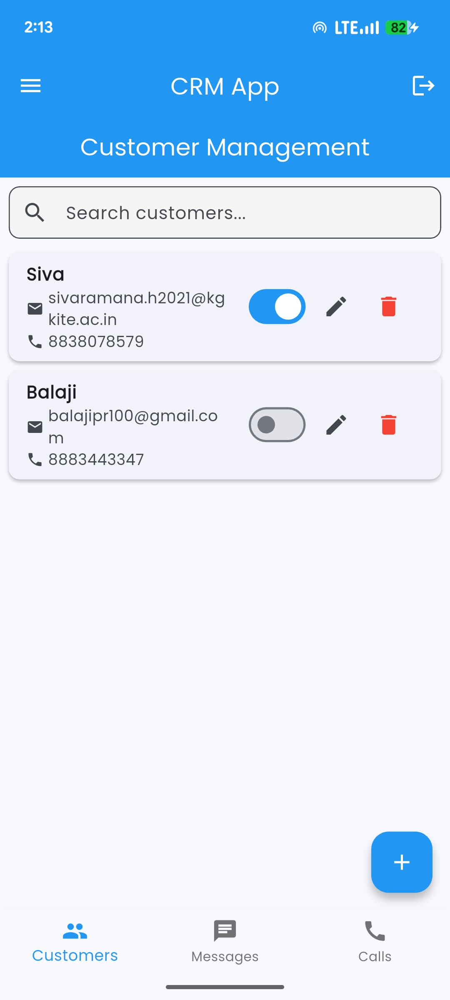
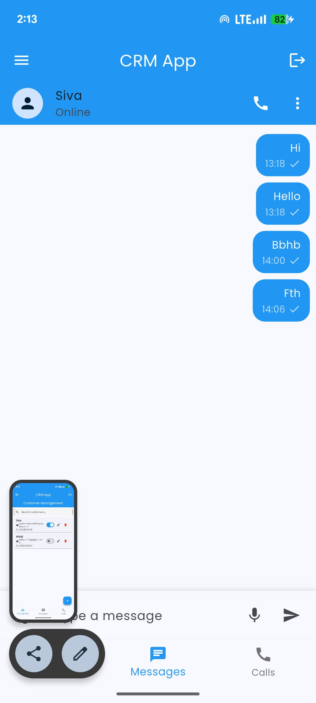
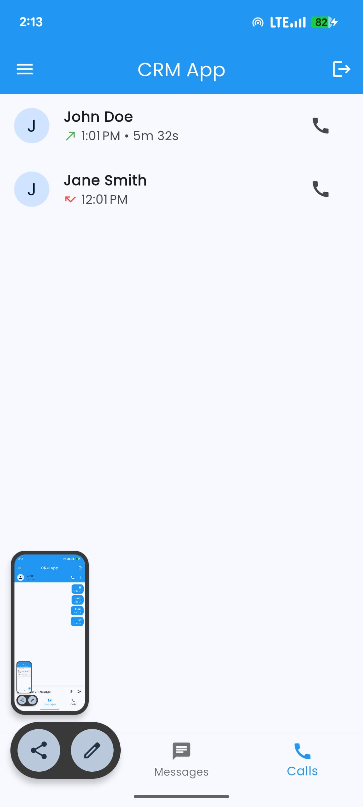
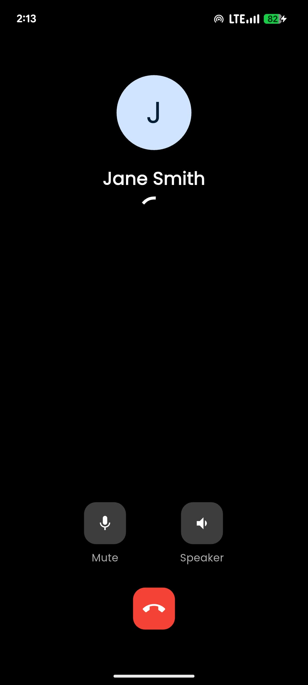
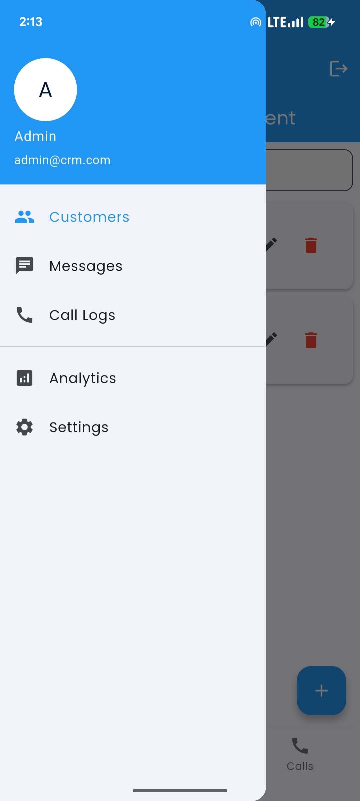

# Flutter CRM Task

A modern CRM (Customer Relationship Management) application built with Flutter, featuring customer management, real-time messaging, and VoIP calling capabilities.

## Screenshots

### Customer Management & Messaging
<div style="display: flex; gap: 10px;">


</div>

### Call Features
<div style="display: flex; gap: 10px;">


</div>

### Navigation


## Implemented Features

### Customer Management
- ✅ Add, edit, and delete customer profiles
- ✅ Search functionality for customers
- ✅ Toggle customer status (active/inactive)
- ✅ Customer details including name, email, and phone
- ✅ Contact synchronization with device contacts

### Communication Features
- ✅ Real-time messaging interface
- ✅ VoIP calling with WebRTC integration
- ✅ Call controls (mute, speaker)
- ✅ Call duration tracking
- ✅ Call history and logs
- ✅ Message delivery status and timestamps

### UI/UX Features
- ✅ Modern Material Design 3 interface
- ✅ Bottom navigation for main features
- ✅ Navigation drawer for additional options
- ✅ Responsive layout
- ✅ Clean and intuitive design

## Technical Implementation

### Architecture
The project follows Clean Architecture principles with three main layers:

1. **Domain Layer**
   - Business entities
   - Repository interfaces
   - Use cases

2. **Data Layer**
   - Repository implementations
   - Data models
   - Local and remote data sources
   - WebRTC service implementation

3. **Presentation Layer**
   - Screens and widgets
   - State management using Riverpod
   - UI components

### Key Technologies & Libraries
- **State Management**: Riverpod for reactive and testable state management
- **WebRTC**: flutter_webrtc for VoIP calling features
- **Local Storage**: Hive for efficient local data storage
- **Contact Management**: contacts_service for device contact integration
- **Permissions**: permission_handler for managing system permissions
- **Backend Integration**: Firebase/Firestore for real-time features

## Project Setup

1. Clone the repository
```bash
git clone https://github.com/SivaRamana-H-V/CRM.git
cd CRM
```

2. Install dependencies
```bash
flutter pub get
```

3. Setup Android permissions (already configured in this repo):
- WebRTC permissions
- Contact permissions
- Internet permissions

4. Run the application
```bash
flutter run
```

## Architecture Decisions

### 1. State Management
- Chose **Riverpod** for its:
  - Testability and maintainability
  - Type safety
  - Dependency injection capabilities
  - Provider composition

### 2. WebRTC Implementation
- Implemented using flutter_webrtc
- Clean separation between UI and business logic
- Proper resource cleanup and state management
- Error handling and fallback mechanisms

### 3. Contact Integration
- Two-way sync between app and device contacts
- Permission handling
- Efficient data conversion and storage

### 4. Code Organization
```
lib/
├── domain/
│   ├── entities/         # Business objects
│   └── repositories/     # Abstract repositories
├── data/
│   ├── models/          # Data models
│   ├── repositories/    # Repository implementations
│   └── services/        # WebRTC and other services
└── presentation/
    ├── screens/         # UI screens
    ├── widgets/         # Reusable widgets
    └── providers/       # State management
```

## Future Improvements

- [ ] Add video call support
- [ ] Implement push notifications
- [ ] Add group calling features
- [ ] Enhance call quality metrics
- [ ] Add call recording capability
- [ ] Implement end-to-end encryption
- [ ] Add file sharing in chat
- [ ] Create comprehensive analytics dashboard

## Notes

- The app uses simulated data for demonstration purposes
- WebRTC implementation focuses on audio calls (but simulation only)
- Contact sync requires appropriate permissions (but not show on UI)
- Tested on Android (minimum SDK 21)
